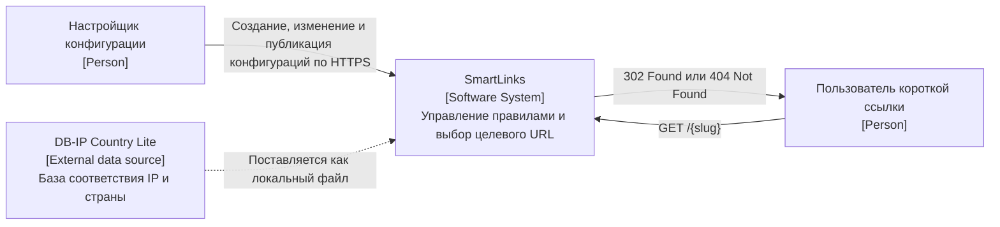
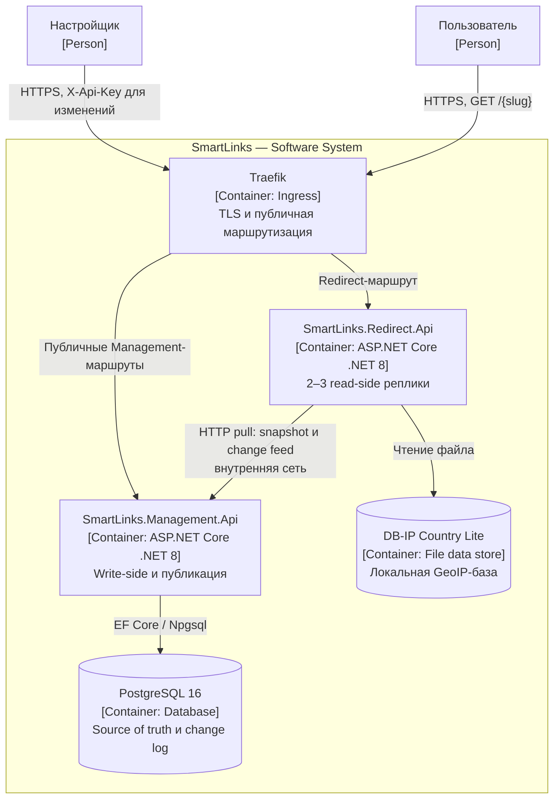
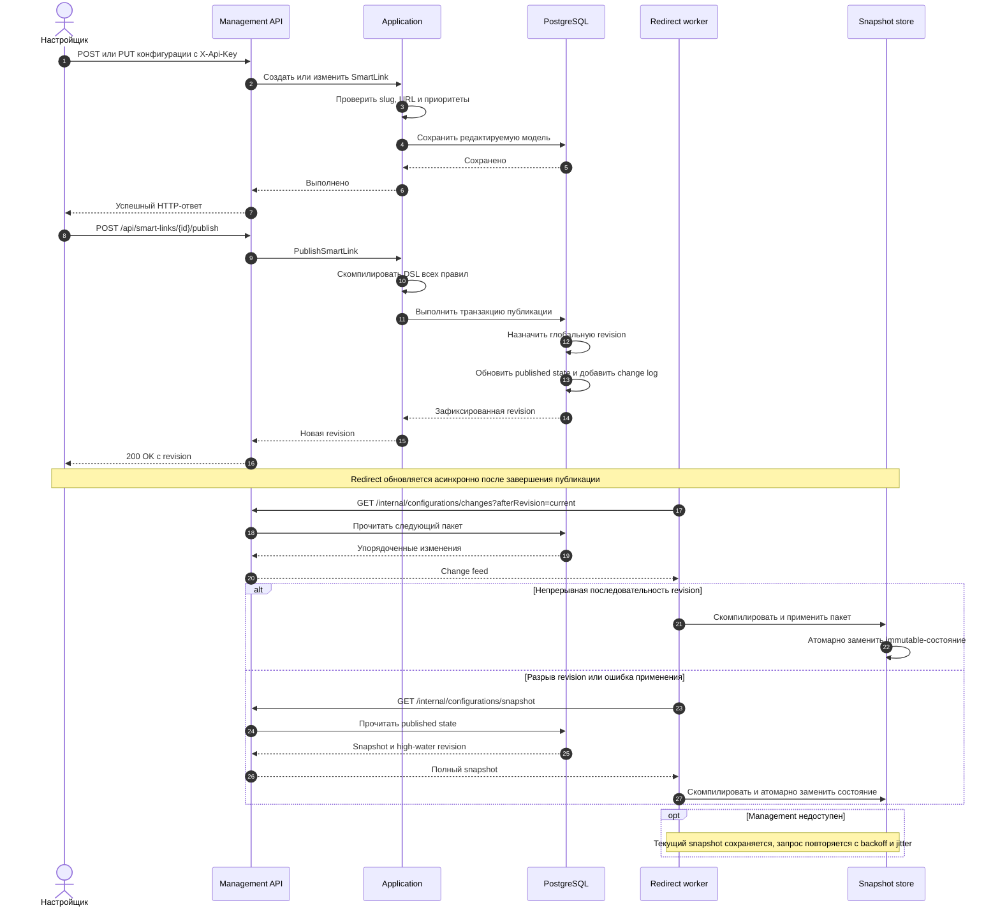
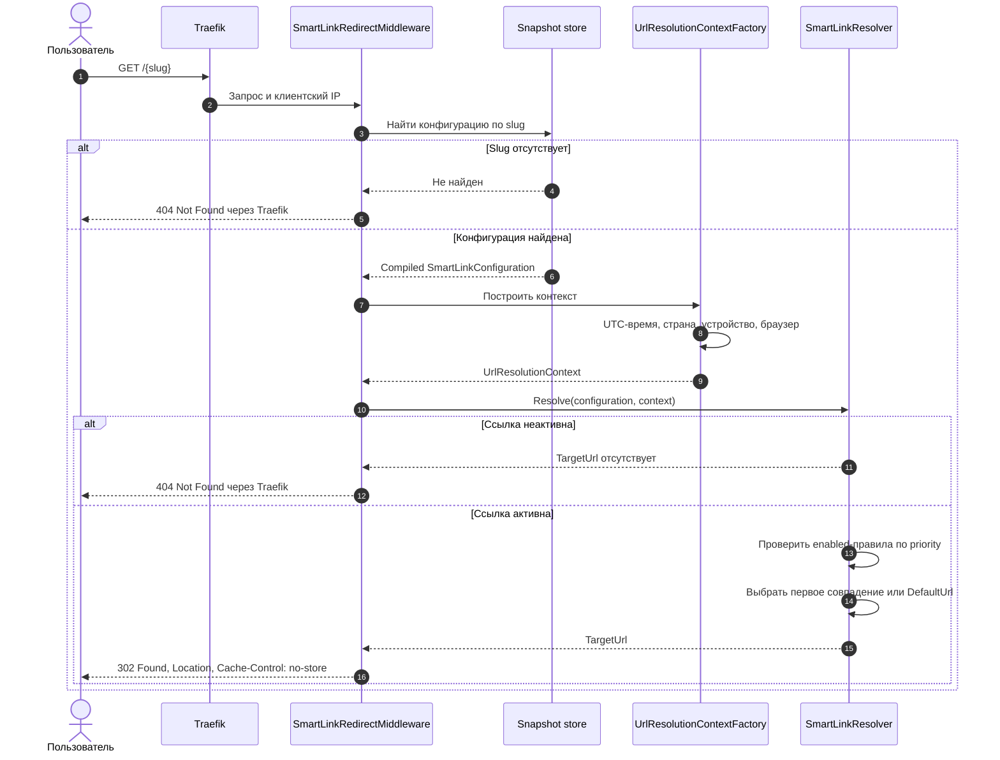

# Архитектура SmartLinks

## 1. Назначение и статус

SmartLinks состоит из двух приложений:

- `SmartLinks.Management.Api` — создание, изменение и публикация конфигураций;
- `SmartLinks.Redirect.Api` — разрешение коротких ссылок по опубликованной read-модели.

Основные требования к архитектуре:

- redirect-path не зависит от PostgreSQL и доступности Management;
- публикации передаются в Redirect асинхронно;
- обновление read-модели атомарно;
- новая Redirect-реплика получает трафик только после первоначальной синхронизации;
- последняя корректная read-модель сохраняется при временной ошибке синхронизации.

## 2. C4: System Context

DB-IP Country Lite является внешним источником данных, но не сетевой зависимостью redirect-path. Redirect читает локальный MMDB-файл без запросов к DB-IP.

## 3. C4: Container

| Компонент | Ответственность |
| --- | --- |
| `SmartLinks.Management.Api` | Write-модель, валидация, публикация, snapshot и change feed |
| PostgreSQL | Редактируемое и опубликованное состояние, глобальная последовательность ревизий, append-only change log |
| `SmartLinks.Redirect.Api` | Локальная compiled read-модель и обработка `GET /{slug}` |
| `SmartLinks.RuleEngine` | Компиляция DSL, построение контекста и выбор правила |
| `SmartLinks.Contracts` | Контракты snapshot и change feed |
| Traefik | TLS и внешняя маршрутизация в целевом K3s-развёртывании |
| DB-IP Country Lite | Локальное определение страны по IP |

`SmartLinks.RuleEngine` и `SmartLinks.Contracts` являются общими библиотеками, а не отдельными C4-контейнерами.

## 4. Публикация конфигурации

Создание и изменение обновляют только редактируемую модель. Redirect получает новую конфигурацию только после публикации.

`PublishSmartLinkUseCase` компилирует DSL всех правил до записи. Затем `ConfigurationChangeLog` в одной транзакции добавляет change log, обновляет published state и фиксирует глобальную `revision`.

Параметры синхронизации по умолчанию:

| Параметр | Значение |
| --- | --- |
| `PollingInterval` | 5 секунд |
| `ChangeBatchSize` | 100 |
| `InitialRetryDelay` | 1 секунда |
| `MaximumRetryDelay` | 30 секунд |

## 5. Обработка redirect-запроса

`SmartLinkRedirectMiddleware` обрабатывает только одно-сегментные `GET /{slug}`. Маршруты `/health` и `/swagger` исключены. Поиск slug выполняется до построения контекста.

Redirect-path использует только локальную память и локальный MMDB-файл DB-IP Country Lite. Запросов к Management, PostgreSQL и внешнему GeoIP API нет.

## 6. Проектные проблемы сложности и решения

Основной источник нелинейного роста сложности — увеличение числа комбинаций времени, страны, устройства, браузера, логических операторов и приоритетов правил. Дополнительная сложность возникает при асинхронной доставке и конкурентном обновлении read-модели.

| Проблема | Проявление в SmartLinks | Решение |
| --- | --- | --- |
| Рост комбинаций условий | В одном сценарии используются mobile, Edge, UTC-интервал + Chrome и default URL; DSL также поддерживает `all`, `any` и `not` | Версионированный JSON DSL, рекурсивный `ConditionDslCompiler`, Composite-условия и независимые `IConditionFactory` |
| Рост центрального алгоритма | При прямой реализации новый признак потребовал бы изменения общего `if/switch` и существующих ветвей | `SmartLinkResolver` работает только с priority и `ICompiledCondition`; структура конкретного условия ему неизвестна |
| Расширение контекста | Добавление нового признака могло бы потребовать изменения общего DTO и всех мест его создания | Типизированные `IResolutionFeature` и отдельные `IResolutionContextContributor` |
| Пересечение User-Agent-маркеров | Edge и Opera содержат маркер Chrome; автоматизированный клиент может содержать маркеры браузера | Порядок распознавания локализован в `UserAgentBrowserResolver` и `UserAgentDeviceResolver` и покрыт отдельными тестами |
| Разные требования к записи и чтению | Публикации нужны валидация и транзакция; redirect-path не должен зависеть от сети и базы | CQRS: Management владеет write-моделью, Redirect — локальной compiled read-моделью |
| Конкурентное обновление проекции | При смене slug или применении пакета читатель не должен видеть промежуточное состояние | Новый `SnapshotState` полностью подготавливается заранее и публикуется через `Interlocked.CompareExchange` |
| Повторы и пропуски при polling | Change feed может содержать старые записи или разрыв после текущей revision | Глобальная монотонная revision, игнорирование повторов, проверка `current + 1`, полная загрузка snapshot при разрыве |
| Пустая проекция после старта | До первой загрузки существующий slug выглядел бы как отсутствующий | Readiness становится положительной только после первоначального snapshot |
| Недоступность Management | Синхронизация временно невозможна | Сохраняется последняя корректная проекция; HTTP-запрос повторяется с exponential backoff и jitter |
| Реальный IP за Traefik | Без forwarded headers определяется IP proxy; без ограничения доверия возможна подмена страны | `KnownNetworks`, `ForwardLimit = 1` и локальный `MaxMindClientLocationResolver` |
| Несколько pod на одном VPS | Реплики Redirect не защищают от отказа единственного узла | Явно заявлена только process-level и pod-level устойчивость, без host-level HA |

### 6.1. Локализация изменений

| Изменение | Требуемые изменения в коде или данных | Не затрагивается |
| --- | --- | --- |
| Новая комбинация существующих условий | JSON DSL и сценарные тесты | Compiler, resolver и middleware |
| Новый предикат над существующим feature | Condition, `IConditionFactory`, DI-регистрация и тесты | Composite, resolver и HTTP-слой |
| Новый источник данных | `IResolutionFeature`, contributor, condition, factory, DI и тесты | `UrlResolutionContextFactory`, resolver и алгоритм `all/any/not` |
| Другой URL, priority или состояние правила | Конфигурация SmartLink | Код Management и Redirect |
| Пропущенная revision | Полная перезагрузка snapshot в `ConfigurationSynchronizer` | Rule Engine и публичный redirect-контракт |

Архитектура локализует изменения в конкретном предикате, источнике контекста или механизме синхронизации. Число бизнес-комбинаций по-прежнему требует сценарных тестов.

## 7. CQRS и eventual consistency

| Аспект | Management: command side | Redirect: query side |
| --- | --- | --- |
| Модель | Редактируемый агрегат и published state | Compiled immutable snapshot |
| Хранилище | PostgreSQL | Память реплики |
| Оптимизация | Валидация и транзакционность | Локальное lock-free чтение |
| Согласованность | Строгая внутри транзакции публикации | Eventual consistency относительно Management |
| Восстановление | PostgreSQL — source of truth | Повторная загрузка полного snapshot |

Гарантии и ограничения:

- успешная публикация revision `N` не означает немедленное применение `N` всеми Redirect-репликами;
- read-your-writes через публичный redirect endpoint не гарантируется;
- разные реплики могут кратковременно использовать разные ревизии;
- внутри одной реплики новое состояние публикуется атомарно;
- устаревшая или повторная revision не откатывает проекцию;
- жёсткая верхняя граница задержки распространения при сбоях отсутствует.

## 8. Применённые паттерны

| Паттерн | Реализация | Роль в SmartLinks |
| --- | --- | --- |
| Interpreter | `ConditionDslCompiler` | Компиляция версионированного JSON DSL |
| Composite | `AllCondition`, `AnyCondition`, `NotCondition` | Вложенные комбинации условий через общий `ICompiledCondition` |
| Strategy | Условия времени, страны, устройства и браузера | Изоляция алгоритма отдельного предиката |
| Chain of Responsibility | Обход правил по `priority` в `SmartLinkResolver` | Выбор первого совпавшего enabled-правила |
| Specification | Реализации `ICompiledCondition` | Инкапсуляция проверок над `UrlResolutionContext` |
| CQRS | Management и Redirect | Разделение write-модели и оптимизированной read-модели |

Dependency Injection используется для регистрации реализаций, но не заявляется отдельным поведенческим паттерном. Command, Adapter и GoF Factory в перечень применённых паттернов не включены.

## 9. Сбои и эксплуатационные ограничения

| Ситуация | Поведение |
| --- | --- |
| Management недоступен | Redirect использует последнюю корректную проекцию |
| PostgreSQL недоступен | Readiness Management становится отрицательной; работающий Redirect продолжает обслуживание |
| Redirect не выполнил первоначальную загрузку | Liveness положительная, readiness отрицательная |
| Change feed содержит разрыв | Пакет не публикуется, загружается полный snapshot |
| Компиляция новой проекции завершается ошибкой | Текущее immutable-состояние сохраняется |
| Перезапускается одна Redirect-реплика | Остальные Ready-реплики могут принимать трафик |
| Отказывает VPS | Недоступны все компоненты |

Изменяющие endpoints Management защищены `X-Api-Key`. Внутренние endpoints snapshot и change feed не используют API-ключ и должны быть исключены из внешней Ingress-маршрутизации. PostgreSQL также не публикуется наружу.

Redirect доверяет `X-Forwarded-For` только для настроенных proxy-сетей. Целевые URL ограничены абсолютными адресами со схемой `http` или `https`. Ответ redirect содержит `Cache-Control: no-store`.

Целевая K3s-конфигурация использует один узел, 2–3 Redirect-реплики и один PostgreSQL с локальным PVC. Она не обеспечивает host-level high availability. Multi-node Kubernetes, HA PostgreSQL, распределённое хранилище, брокер сообщений и автоматическое масштабирование не входят в обязательный объём проекта.
